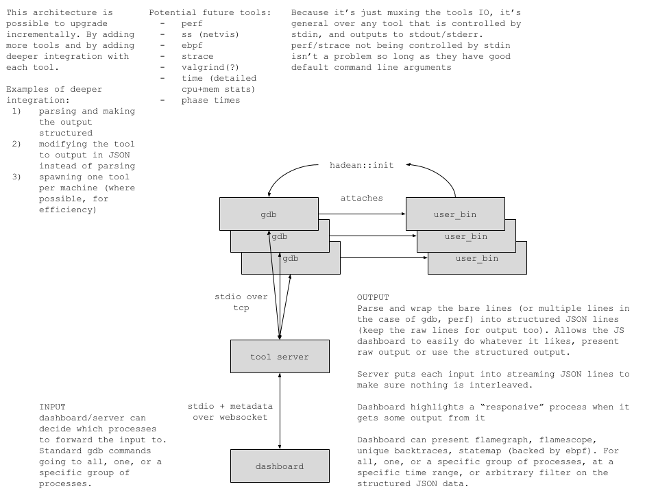

# gdb dashboard

## motivation

debugging parallel and/or distributed programs is _hard_.
we wouldve saved many _many_ hours of developer time by having a tool like this.
(and saved even more time with similar tool integrations based on the tool server, looking at you perf, ss, strace, etc)

concrete problems we/i have faced in debugging
 - coredumps are not enough
   1. you dont necessarily get the full process memory
   2. gdb often says "you cant do this without a process"
   3. they are often truncated
   4. they can overwrite each other in the same path
   5. theres no way to inspect many coredumps
 - coredumpctl only addresses problems 4 and 5
 - distributed programs are even harder to debug (coredumpctl over ssh is _okay_)
   - its a pain to ssh into _every_ box
   - its a pain to attach to _every_ process in the program
   - when one process crashes it often cascades causing others to crash
     - deciding what happened first is hard
       - unless ntp is doing a great job
       - or gdb gets to the process before it can cascade
 - manually attaching to processes is hard
   - especially on a live system
   - need some way to identify the bad process before it goes bad
   - either by guesswork
   - or often by doing `printf("pid %d\n", getpid()); sleep(60);` to attach to something
     - this involves editing the code, hoping the crash is reproducible and going again

gdb server aims to solve *all* of these problems with a simple approach:
 - *every* new process in the program is spawned with a gdb "harness" attached at startup
 - the stdin, stdout, and stderr streams of each newly spawned gdb instance is connected to the tools server by the harness
 - the tools server serves a web dashboard that the gdb instances can be controlled from
 - by parsing the text output, the dashboard provides structured information to the user such as
   - unique backtraces among many
   - sorting the crashes by timestamp

alternatively, the harness supports another mode where the gdb instance is only started when a signal is caught
 - this _may_ have lower overhead, particularly on process startup
 - but it rules out using breakpoints, watchpoints, catchpoints, or anything more complicated than "break on signal"

this solves the problems outlined above
 - there is no more manual attaching, because everything is attached to by default, with minimal runtime overhead
 - there is no more recompilation and hoping its reproducible because gdb is always attached
 - a crash wont cascade because gdb gets control as soon as the crash happens, stopping any communication
   - the cascade will only happen if the _absence_ of timely communication causes other crashes
 - there is no more relying on partial coredumps or not having the process around still

## architecture

